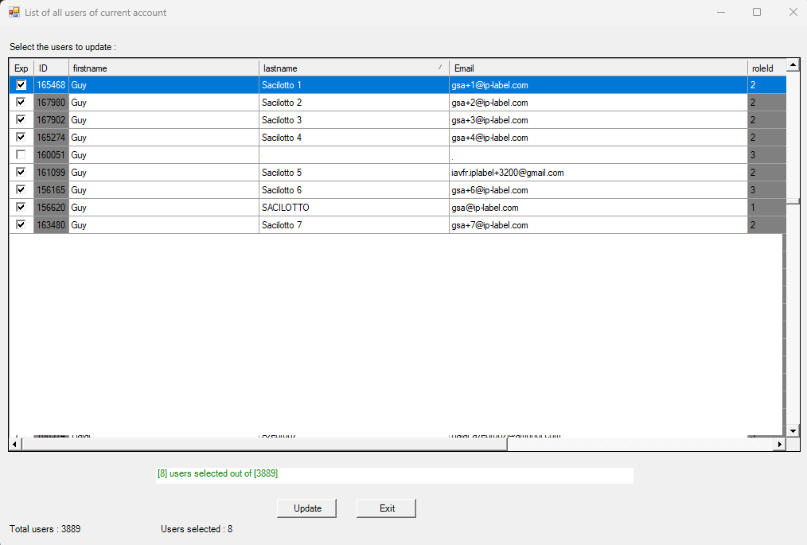

# Ekara-Change_Users

<a href="https://api.ekara.ip-label.net/"> 

## Description
This [Powershell](https://learn.microsoft.com/powershell/scripting/overview) allows you to modify [Ekara](https://ekara.ip-label.net/) user settings (firstname / Lastname / Email).

For this, the script uses the Rest [Ekara](https://api.ekara.ip-label.net/) API.

## Screens

## Prerequisites

-|version
--|:--:
Ekara plateform|>=24.12
PowerShell|>=5
.NET|>=4
Ekara credentials (Account and password)

## Download

[github-download]: https://github.com/MrGuyTwo/Ekara-Change_Users/releases
 - [`Ekara-Change_Users`][github-download]

## The main function
Methods called : 
- auth/login
- adm-api/users
- adm-api/user
